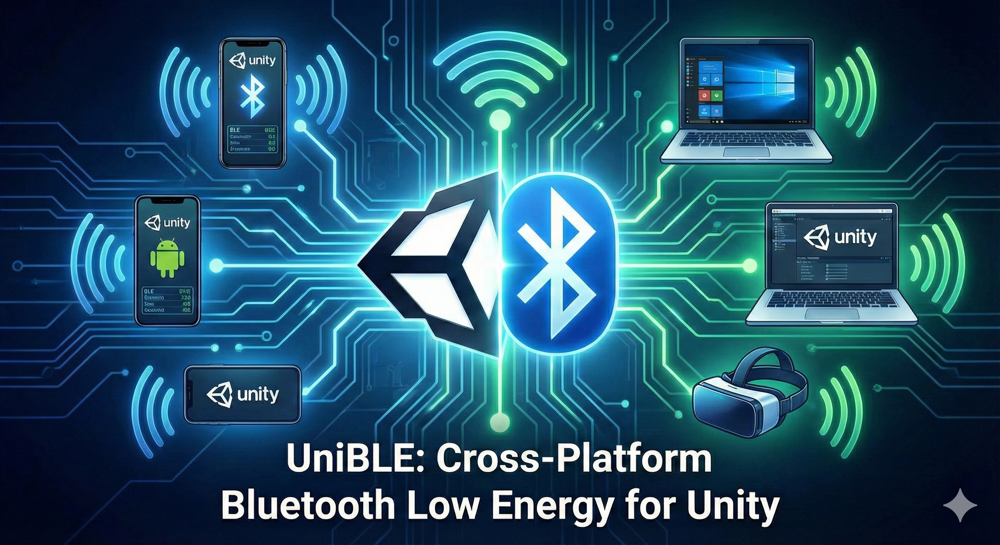
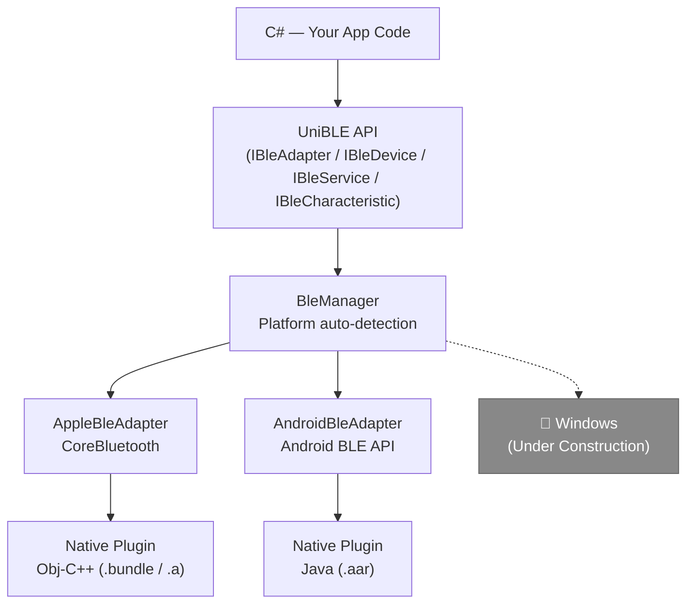

# UniBLE

**Cross-platform BLE library for Unity**

[](LICENSE)
[](https://unity.com/)
[](#supported-platforms)
[](#supported-platforms)
[](#supported-platforms)



UniBLE provides a unified async/await BLE (Bluetooth Low Energy) API across Android, iOS, macOS, and Windows, backed by native plugins for each platform.



## Features

- **Unified API** — Single C# interface for all platforms
- **async/await** — All BLE operations return `Task<T>` with `CancellationToken` support
- **BLE 4.0+ GATT Client** (Central role)
- **Scan** with optional service UUID filtering
- **Connect / Disconnect** with connection state tracking
- **Service & Characteristic Discovery**
- **Read / Write / Notify / Subscribe** for characteristics
- **Runtime Permission** handling (Android)
- **Known Device** reconnection by device ID (iOS: OS-known devices only)
- **Advertisement Data & RSSI** retrieval
- **16/32/128-bit UUID** support with implicit string conversion

## Supported Platforms

| Platform | Min Version | Output Format | Architecture |
|----------|------------|---------------|--------------|
| Android | 10 (minSdk 29) | `.aar` | armeabi-v7a, arm64-v8a, x86, x86_64 |
| iOS | 18, 26 | `.a` + `.xcframework` | arm64 (device+sim), x86_64 (sim) |
| macOS | 15 (Sequoia) | `.bundle` (Universal) | arm64 + x86_64 |
| Windows | 11 | `.dll` (Uner Construction) | x64 *(Under Construction)* |

> **Note:** Windows support is under construction. Pre-built `.dll` is included but no build script is provided.

## Requirements

- **Unity 2022.3 LTS** or later
- **Android**: Android SDK, Java JDK 17+
- **iOS/macOS**: Xcode command line tools (clang++, xcodebuild, lipo)

## Installation

### UPM (Unity Package Manager)

Add the following to your `Packages/manifest.json`:

```json
{
  "dependencies": {
    "com.github.yoshidan.unible": "https://github.com/yoshidan/UniBLE.git?path=Assets/UniBLE"
  }
}
```

### Manual

1. Clone the repository:
   ```bash
   git clone https://github.com/yoshidan/UniBLE.git
   ```

2. Copy the `Assets/UniBLE/` folder into your Unity project's `Assets/` directory.

3. Unity will automatically detect the native plugins for your target platform.

## Quick Start

```csharp
using UniBLE;
using UnityEngine;

public class BleExample : MonoBehaviour
{
    async void Start()
    {
        // 1. Get adapter (auto-detects platform)
        var adapter = BleManager.Adapter;

        // 2. Check availability
        bool available = await adapter.IsAvailableAsync();
        if (!available) return;

        // 3. Request permission (required on Android)
        bool granted = await adapter.RequestPermissionAsync();
        if (!granted) return;

        // 4. Scan for devices
        await adapter.StartScanAsync(result =>
        {
            Debug.Log($"Found: {result.Device.Name} RSSI:{result.Rssi}");
        });

        // 5. Stop scan
        await adapter.StopScanAsync();
    }
}
```

### Connect to a Known Device (No Scan)

```csharp
// Use a previously saved device ID (e.g., from a past scan)
var device = await BleManager.Adapter.GetDeviceAsync(deviceId);
await device.ConnectAsync();
```

**iOS note:** `GetDeviceAsync` can only connect if the OS already knows the device UUID
from a previous discovery/connection. If iOS does not recognize the UUID, the connection will fail.

### Reading & Writing Characteristics

```csharp
// Connect to a device
await device.ConnectAsync();

// Discover services and characteristics
var service = await device.GetServiceAsync("180D");
var characteristic = await service.GetCharacteristicAsync("2A37");

// Read
byte[] data = await characteristic.ReadAsync();

// Write
await characteristic.WriteAsync(new byte[] { 0x01 });

// Subscribe to notifications
await characteristic.SubscribeAsync(data =>
{
    Debug.Log($"Notification: {BitConverter.ToString(data)}");
});

// Cleanup
await characteristic.UnsubscribeAsync();
await device.DisconnectAsync();
```

### Connection State Monitoring

```csharp
// Monitor connection state changes
device.OnConnectionStateChanged += state =>
{
    Debug.Log($"Connection state: {state}");
    // BleConnectionState: Disconnected, Connecting, Connected, Disconnecting
};

// Check current state
if (device.ConnectionState == BleConnectionState.Connected)
{
    Debug.Log("Device is connected");
}
```

### UUID Usage

```csharp
// BleUuid supports implicit conversion from string
BleUuid uuid = "180D";                                      // 16-bit short UUID
BleUuid full = "0000180d-0000-1000-8000-00805f9b34fb";      // Full 128-bit UUID
```

## API Overview

| Type | Role |
|------|------|
| `BleManager` | Static entry point. Access `BleManager.Adapter` to get the platform-specific `IBleAdapter`. |
| `IBleAdapter` | Scan, check availability, request permissions, connect to known devices. |
| `IBleDevice` | Connect, disconnect, discover services. Properties: `Id`, `Name`, `ConnectionState`. |
| `IBleService` | Discover characteristics. Property: `Uuid`. |
| `IBleCharacteristic` | Read, write, subscribe, unsubscribe. Properties: `Uuid`, `Properties`. |
| `BleUuid` | `readonly struct`. Supports 16/32/128-bit UUIDs with implicit `string` conversion. |
| `ScanResult` | Contains `Device`, `Rssi`, and `AdvertisementData`. |
| `BleException` | Thrown on BLE errors. Contains `BleErrorCode` (14 error types). |
| `BleAdapterState` | `Unknown`, `Resetting`, `Unsupported`, `Unauthorized`, `PoweredOff`, `PoweredOn` |
| `BleConnectionState` | `Disconnected`, `Connecting`, `Connected`, `Disconnecting` |
| `CharacteristicProperties` | `[Flags]` enum: `Broadcast`, `Read`, `WriteWithoutResponse`, `Write`, `Notify`, `Indicate` |

## Building Native Plugins

Native plugins are pre-built and included in the repository. To rebuild from source:

```bash
# Build all platforms
make all

# Build individual platforms
make ios       # iOS static library (.a) + XCFramework
make macos     # macOS universal bundle (.bundle)
make android   # Android library (.aar)

# Clean build artifacts
make clean

# Show available targets
make help
```

### Prerequisites

| Platform | Tools |
|----------|-------|
| iOS / macOS | Xcode command line tools (`clang++`, `xcodebuild`, `lipo`) |
| Android | Java JDK 17+, Gradle (or use included `gradlew`; Gradle 9.3.0, AGP 8.7.3) |

## Samples

> **Note:** Samples are not included in the UPM package. Clone the repository to use them.

A sample BLE scanner is included at `Assets/Samples/BleScanner/`:

| File | Description |
|------|-------------|
| `BleScannerSample.unity` | Pre-built sample scene |
| `BleScannerSample.cs` | Scans for BLE devices and displays a list |
| `DeviceDetailPanel.cs` | Service & characteristic operations UI |
| `DeviceListItem.cs` | Device list entry component |
| `Prefabs/DeviceListItem.prefab` | Device list item prefab |

Open `Assets/Samples/BleScanner/BleScannerSample.unity` and press Play to scan for nearby BLE devices.

## Contributing

Contributions are welcome! Please follow these guidelines:

1. **Issues** — Search existing issues before creating a new one. Include platform, Unity version, and reproduction steps.
2. **Pull Requests** — Fork the repository, create a feature branch, and submit a PR with a clear description.
3. **Code Style** — Write comments and documentation in English. Follow existing code conventions.
4. **Testing** — Test on at least one physical device before submitting (BLE does not work in simulators).
5. **Native Plugins** — If modifying native code, rebuild the affected platform plugin and include the updated binary.

## License

[MIT License](LICENSE) — Copyright (c) 2026 Naohiro Yoshida
